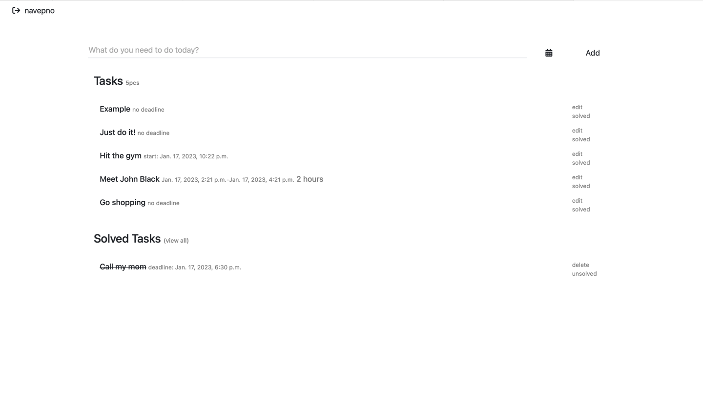

# Well Done

WellDone is a simple todo website based on Django.

What it look's like:


##Setup

```

pip3 install -r requirements.txt
python3 manage.py makemigrations
python3 manage.py migrate
python3 manage.py createsuperuser

```

Now you can run WellDone application by this command:

```
python3 manage.py runserver
```
